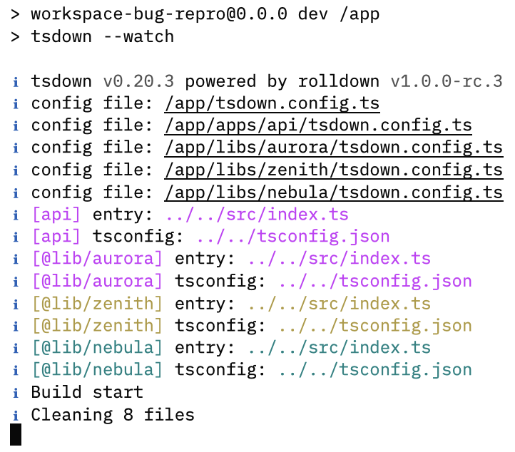

# workspace-bug-repro

This repository is a minimal reproduction of a bug in the tsdown workspace feature. The bug occurs when trying to run `tsdown --watch` inside a Docker container in workspace mode.

## Steps to Reproduce

1. Clone this repository.
2. Run the project in Docker.

```bash
./run.sh
```

3. Observe that the `tsdown --watch` command gets stuck on "Cleaning 8 files" and does not respond to file changes.


